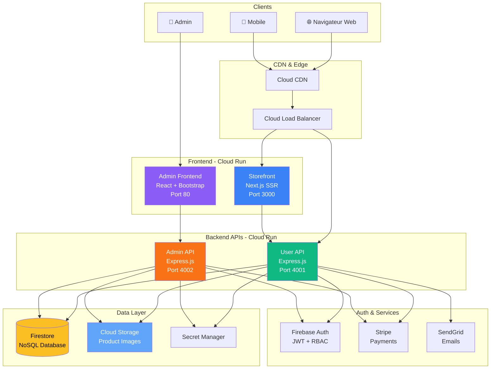
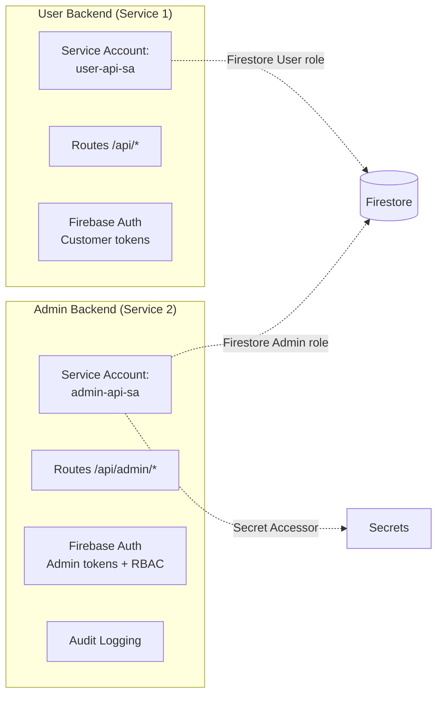

# Play.tn - Architecture E-Commerce

## Diagramme d'Architecture



## Séparation Backend Stricte



## Modèle de Données Firestore

### Collections

| Collection | Document ID | Description |
|---|---|---|
| `users` | Firebase UID | Profils utilisateurs |
| `products` | Auto-generated | Catalogue produits |
| `categories` | Auto-generated | Catégories de produits |
| `brands` | Auto-generated | Marques |
| `orders` | Auto-generated | Commandes |
| `carts` | userId/sessionId | Paniers |
| `reviews` | Auto-generated | Avis produits |
| `coupons` | Auto-generated | Codes promo |
| `blog_posts` | Auto-generated | Articles de blog |
| `blog_categories` | Auto-generated | Catégories blog |
| `settings` | Singleton keys | Configuration site |
| `audit_logs` | Auto-generated | Logs d'audit admin |

### Schéma `products`
```json
{
  "slug": "manette-ps5-dualsense",
  "name": "Manette PS5 DualSense",
  "description": "...",
  "shortDescription": "...",
  "categoryId": "cat_xxx",
  "categoryPath": ["accessoires-gaming", "manettes"],
  "brandId": "brand_xxx",
  "images": [
    { "id": "img_1", "url": "https://...", "alt": "...", "order": 0, "isMain": true }
  ],
  "variants": [
    { "id": "var_1", "name": "Blanc", "sku": "PS5-DS-WHT", "price": { "amount": 189.9, "currency": "TND" }, "stock": 25, "attributes": { "color": "Blanc" }, "isActive": true }
  ],
  "price": { "amount": 189.9, "currency": "TND" },
  "compareAtPrice": { "amount": 229.9, "currency": "TND" },
  "sku": "PS5-DS-WHT",
  "stock": 25,
  "tags": ["ps5", "manette", "sony"],
  "isActive": true,
  "isFeatured": true,
  "isOnSale": true,
  "averageRating": 4.7,
  "reviewCount": 34,
  "seo": {
    "title": "Manette PS5 DualSense | Play.tn",
    "description": "Achetez la manette PS5 DualSense en Tunisie...",
    "keywords": ["manette ps5", "dualsense", "tunisie"]
  },
  "createdAt": "Timestamp",
  "updatedAt": "Timestamp"
}
```

## Matrice RBAC

| Ressource | Admin | Manager | Editor | Support |
|---|---|---|---|---|
| Dashboard | ✅ Complet | ✅ Complet | ❌ | ✅ Limité |
| Produits | ✅ CRUD | ✅ CRUD | ✅ CRUD | ❌ |
| Catégories | ✅ CRUD | ✅ CRUD | 👁️ Lecture | ❌ |
| Marques | ✅ CRUD | ✅ CRUD | 👁️ Lecture | ❌ |
| Commandes | ✅ Complet | ✅ Complet | ❌ | ✅ Lecture + Statut |
| Clients | ✅ Complet | ✅ Lecture | ❌ | ✅ Lecture |
| Coupons | ✅ CRUD | ✅ CRUD | ❌ | ❌ |
| Blog | ✅ CRUD | ✅ CRUD | ✅ CRUD | ❌ |
| Médias | ✅ Complet | ✅ Complet | ✅ Upload | ❌ |
| Paramètres | ✅ Complet | 👁️ Lecture | ❌ | ❌ |
| Logs d'audit | ✅ Lecture | ❌ | ❌ | ❌ |
| Rôles/Users | ✅ Complet | ❌ | ❌ | ❌ |

## Estimation de Coûts GCP (Startup)

| Service | Coût estimé/mois |
|---|---|
| Cloud Run (4 services, min 0) | ~$5-15 |
| Firestore (petite charge) | ~$0-5 |
| Cloud Storage (< 10 GB) | ~$0.50 |
| Cloud CDN | ~$1-5 |
| Secret Manager | ~$0.06 |
| Firebase Auth | Gratuit (< 50k users) |
| **Total estimé** | **~$7-26/mois** |

## Checklist SEO

- [x] SSR avec Next.js App Router
- [x] URLs propres et sémantiques (/produits/manette-ps5-dualsense)
- [x] Balises canonical sur toutes les pages
- [x] robots.txt dynamique
- [x] sitemap.xml dynamique (produits, catégories, blog)
- [x] Schema.org: Product, BreadcrumbList, Organization, FAQ
- [x] Open Graph + Twitter Cards
- [x] Images optimisées (next/image + WebP)
- [x] Lazy loading images
- [x] HTML sémantique (header, main, nav, article, section)
- [x] Core Web Vitals optimisés
- [x] Fil d'Ariane (breadcrumbs) sur toutes les pages
- [x] Liens internes stratégiques
- [x] Module blog pour content marketing
- [x] Balises hreflang
- [x] Meta descriptions uniques par page
- [x] Titres H1 uniques par page
